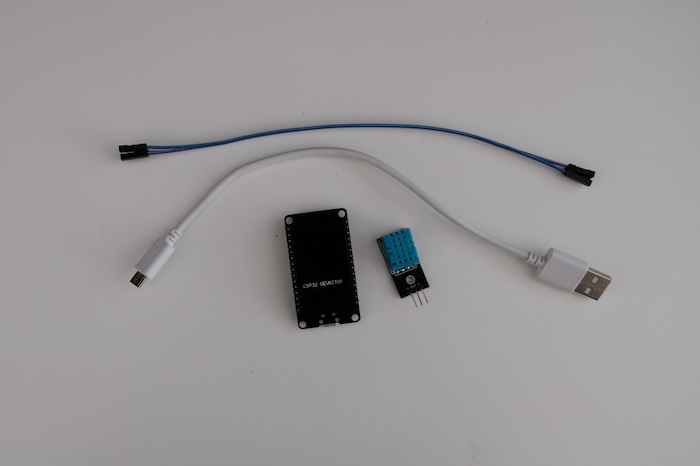
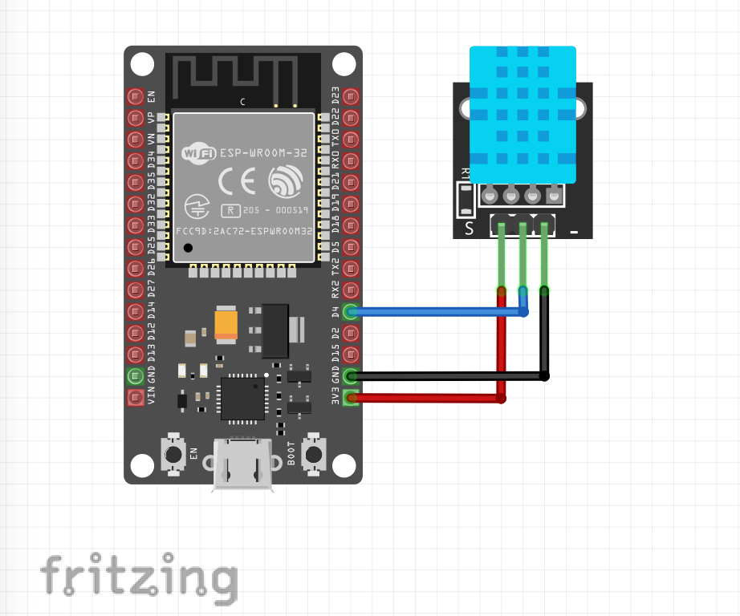

# Room confort monitoring with Arduino and Grafana

The room confort monitoring let's you see the current and previous temperature and humidity data of your room (or any place you set up monitoring in). This project was part of **[GrafanaCONline 2021 Easy DIY IoT projects with Grafana](https://grafana.com/go/grafanaconline/2021/diy-iot/)** session.

## Arduino & Grafana

To start, review the **[Grafana DIY IoT](https://github.com/grafana/diy-iot/blob/main/README.md)**.

## Hardware

To build this system, you will need:

- **1 [DHT11](https://components101.com/sensors/dht11-temperature-sensor)** sensor to measure temperature and humidity
- **1 [ESP32 DEVKIT DOIT](https://randomnerdtutorials.com/getting-started-with-esp32/)** development board
- **3 F-F Dupont cables**
- **1 micro USB cable**
- **1 USB charger**

## Libraries:

In Arduino IDE, download following libraries: 

- **DHT sensor library by** Adafruit
- **Adafruit Unified Sensor** by Adafruit

## Circuit & Wiring diagrams

## Software

Download this repo that includes the software for room comfort monitoring. Update **config.h** file with your names, passwords and API keys. Upload software to your board using Arduino IDE.
